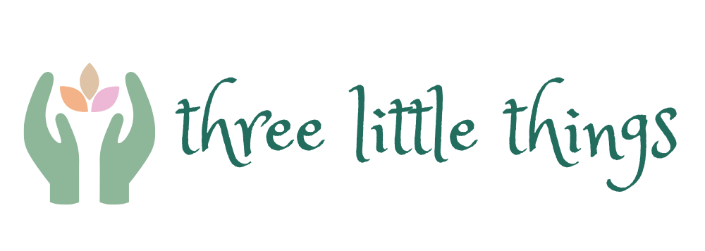

# Three Little Things

## Inspiration
Feeling unaccomplished throughout the day and not being able to sleep? Being able to review what made you happy and what tasks you accomplished can benefit your mental health and boost your productivity.

## What It Does
Three little things reminds you to write down three things that made you happy and three things that you accomplished for the day. You can also use the analytics tool to look at previous entries in the past week, month, year, etc.

## How We Built It
Built using Flutter as the frontend for our Android application and Firebase as the backend/database, which we used for tracking analytics.

## Challenges We Ran Into
- Installing Flutter and connecting Flutter to Firebase
- Setting up Gradle dependencies
- Obtaining Google Cloud credits

## Accomplishments That We Are Proud of
- Creating our first Android application
- Getting Flutter and Firebase connected and working together

## What We Learned
- Initial setup can be difficult, so start early
- Preparation is important

## What's Next for Three Little Things
- Upgrade for community tab (chatbot, mentors, etc.)
- Add task manager/todo list features
- Add journaling features